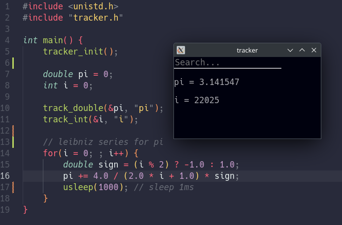

# tracker

**tracker** is a tool for tracking the variables in a program. it serves as a cleaner alternative to `print` statements.

## usage
launch a program by calling it as an argument. for example `tracker ./compute-pi`